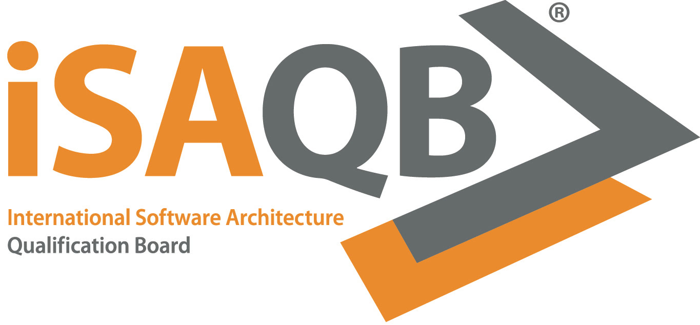

=  Certified Professional for Software Architecture^(R)^ (CPSA)
- Architecture Documentation (ADOC) Curriculum -

The international Software Architecture Qualification Board (link:https://isaqb.org[iSAQB]) defines curricula on several levels for software architects.

The goal of this module is to equip architects with enough 

The terminology used in the iSAQB curricula can be found as a (freely available) ebook, published on https://leanpub.com/isaqbglossary/read[Leanpub].

== Development versions

The ADOC Curriculum is currently maintained and published in English (EN) only.
Maintainers and volunteer reviewers collaborate on GitHub to improve the curriculum.

|===
| Version | Comments | HTML | PDF

| English
|
| link:adoc-curriculum_en.html[HTML]
| link:adoc-curriculum_en.pdf[PDF]

| English
| ✔
| link:adoc-curriculum_remarks_en.html[HTML]
| link:adoc-curriculum_remarks_en.pdf[PDF]

|===
